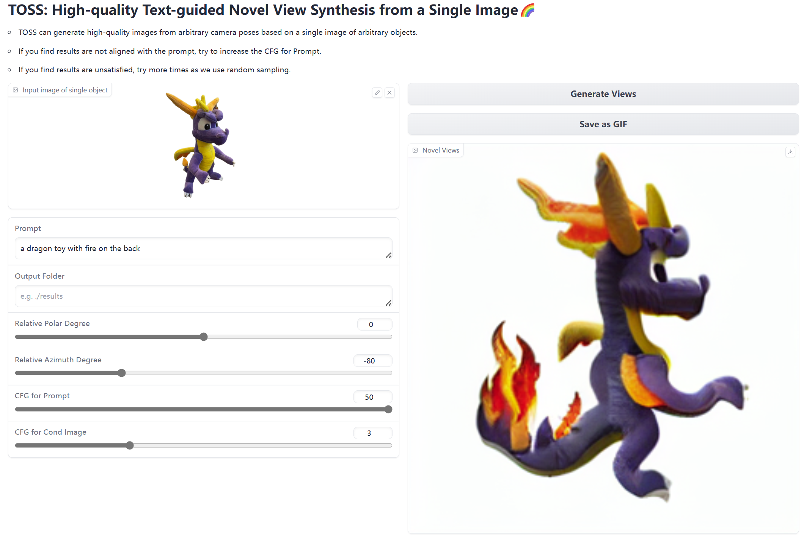

# TOSS: High-quality Text-guided Novel View Synthesis from a Single Image (ICLR2024)

#####  <p align="center"> Yukai Shi, Jianan Wang, He Cao, Boshi Tang, Xianbiao Qi, Tianyu Yang, Yukun Huang, Shilong Liu, Lei Zhang, Heung-Yeung Shum
<p align="center">
  
</p>

Official implementation for *TOSS: High-quality Text-guided Novel View Synthesis from a Single Image*.

**TOSS introduces text as high-level sementic information to constraint the NVS solution space for more controllable and more plausible  results.**

## [Project Page](https://toss3d.github.io/) | [ArXiv](https://arxiv.org/abs/2310.10644) | [Weights](https://huggingface.co/shiyukai/TOSS)


<iframe src="assets/3d_generation_video.mp4" scrolling="no" border="0" frameborder="no" 
framespacing="0" allowfullscreen="true" height=600 width=800> 
</iframe>

## Install

### Create environment
```bash
conda create -n toss python=3.9
conda activate toss
```

### Install packages
```bash
pip install torch==2.0.0 torchvision==0.15.1 torchaudio==2.0.1 --index-url https://download.pytorch.org/whl/cu118
pip install -r requirements.txt
git clone https://github.com/openai/CLIP.git
pip install -e CLIP/
```
### Weights
Download pretrain weights from [this link](https://huggingface.co/shiyukai/TOSS) to sub-directory ./ckpt

## Inference

We suggest gradio for a visualized inference and test this demo on a single RTX3090.

```
python app.py
```




## Todo List
- [x] Release inference code.
- [x] Release pretrained models.
- [ ] Upload 3D generation code.
- [ ] Upload training code.

## Acknowledgement
- [ControlNet](https://github.com/lllyasviel/ControlNet/)
- [Zero123](https://github.com/cvlab-columbia/zero123/)
- [threestudio](https://github.com/threestudio-project/threestudio)

## Citation

```
@article{shi2023toss,
  title={Toss: High-quality text-guided novel view synthesis from a single image},
  author={Shi, Yukai and Wang, Jianan and Cao, He and Tang, Boshi and Qi, Xianbiao and Yang, Tianyu and Huang, Yukun and Liu, Shilong and Zhang, Lei and Shum, Heung-Yeung},
  journal={arXiv preprint arXiv:2310.10644},
  year={2023}
}
```